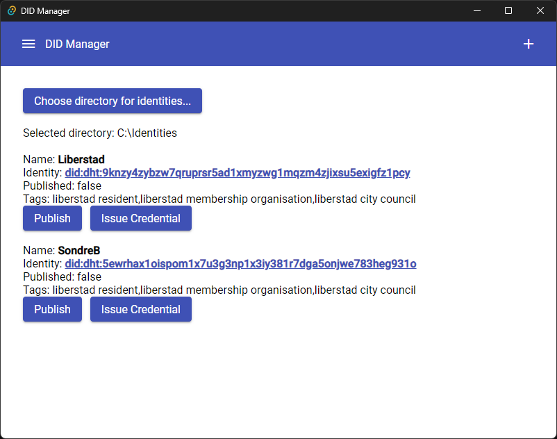

README.md
# Blockcore DID Manager

Focused app that helps you manage DID identities and issue verifiable credentials (VC).

## Supported DIDs

- did:dht

## Recommended IDE Setup

[VS Code](https://code.visualstudio.com/) + [Tauri](https://marketplace.visualstudio.com/items?itemName=tauri-apps.tauri-vscode) + [rust-analyzer](https://marketplace.visualstudio.com/items?itemName=rust-lang.rust-analyzer) + [Angular Language Service](https://marketplace.visualstudio.com/items?itemName=Angular.ng-template).
